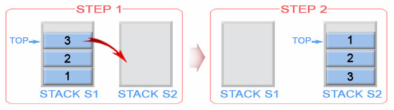

## stacks_intro_2

This lesson will introduce using multiple stacks in concert to accomplish tasks that would be impossible with only a single stack.

**Important**: If you haven't already completed [`stacks_intro_1`](../stacks_intro_1/README.md), please do that first.

---

### Concepts

Now that you're familiar with using a stack, one of the downsides you'll notice about using a single stack is: in order to dynamically get a value somewhere inside the stack, you need to pull off every value above it and throw most of them away. In order to preserve those values, we need at least one other data structure to hold those values. One way to handle this is by using a second stack:



As values are `.pop()`ed off the first stack, they are `.push()`ed onto the second stack. Notice how the order of the second stack is the reverse of the first stack. If all the values are moved from the first stack to the second, we can say the first stack has been "flipped" onto the second. If the first stack represents the original order, we can call the first stack "upright" and the second stack "inverted". If we need to return the remaining values back to the upright stack, we simply flip the inverted stack onto it.

#### Quiz

- What happens to the order of values that are moved from one stack to another?
- How can a stack be returned to it's original state after examining its internal values?

---

### The `Stack` class

These exercises use the same `Stack` class as used in [`stacks_intro_1`](../stacks_intro_1/README.md) (for reference, see its [interface](../../structures/stack/interface.md), [tests](../../structures/stack/index.test.js), and [implementation](../../structures/stack/simplified.js)).

---

### Before You Begin

Be sure to check out a new branch (from `master`) for this exercise. Detailed instructions can be found [**here**](../../guides/before_each_exercise.md). Then navigate to the `exercises/stacks_intro_2` directory in your terminal.

---

### Exercise

Do the following exercises in their respective files. For all of these warm-up exercises, you will use two or more `Stack`s. One is given to you. Other `Stack`s must be instantiated (`new Stack()`). Uncomment the `require()` statement at the top to import the `Stack` class. Do not use any data structures outside of that. Constant-size primitives (`undefined`, `null`, boolean, numbers, single characters (`'g'`), & symbols) are ok. Following each exercise, run the `npm test` command (from within the `exercises/stacks_intro_2` directory) to verify it works.

_Note_: Given that these exercises are meant to a) build up familiarity with this data structure, and b) provide practice programming for high performance (the "Algorithms" in "Data Structures & Algorithms"), try to reduce any unnecessary steps the engine must execute, and please do not call any of your custom functions within these definitions.

#### Debugging Notes

While the test output generated by the `npm test` script describes how the exercises _should_ behave and the specific steps they're failing on, it may not tell you _exactly_ what's going on under the hood. To help with that, there are extra tools included to help with debugging:
- If you wish to experiment with either the provided data structures or your exercise solutions, the `npm run repl` script can be run within this directory to enter Node's interactive interpreter. It is the same interface you get when running the `node` command by itself (without specifying a file), except that the data structures and exercise exports are preloaded for you. That means you can jump straight into experimenting with them, without having to manually `require()` them first. However, anything that would cause the exercise scripts to crash (like syntax errors) needs to be fixed first.
- If you wish to see precisely why a test is failing, the `npm run test:debug` script can be run within this directory to enable breakpoints, statement-by-statement execution, and inspecting variables via VS Code's debugging environment (which is very similar to the Source tab on the Chrome inspector).

1. #### `count(stack)`
    In `count.js`, implement the `count(stack) -> total` function - Count the number of values in `stack`, restoring `stack` to its original state.

    | Parameter | Argument |
    | --- | --- |
    | `stack` | An instance of `Stack`. |

    | Return Value |
    | --- |
    | The number of values in `stack`. |

    | Side Effect |
    | --- |
    | None: `stack` should end up exactly how it started. |

    ##### Examples
    ```js
    count(emptyStack); // returns: 0
    ```

    ```js
    filledStack;
    // contains, from bottom to top: 2, 3, 45, 24, 5, 32

    count(filledStack); // returns: 6

    filledStack;
    // contains, from bottom to top: 2, 3, 45, 24, 5, 32
    ```

1. #### `takeBottom(stack)`
    In `take_bottom.js`, implement the `takeBottom(stack) -> value` function - Remove and return the bottom value from `stack`, restoring all other values onto `stack`.

    | Parameter | Argument |
    | --- | --- |
    | `stack` | An instance of `Stack`. |

    | Context | Return Value |
    | --- | --- |
    | `stack` is empty. | `undefined` |
    | `stack` is not empty. | The bottom value of `stack`. |

    | Context | Side Effect |
    | --- | --- |
    | `stack` is not empty. | The bottom value is removed from `stack`. |

    ##### Examples

    `stack` is empty
    ```js
    emptyStack;
    // contains no values
    takeBottom(emptyStack); // returns: undefined

    emptyStack;
    // contains no values
    ```

    `stack` is not empty
    ```js
    filledStack;
    // contains, from bottom to top: 74, 36, 37, 52

    takeBottom(filledStack); // returns: 74

    filledStack;
    // contains, from bottom to top: 36, 37, 52
    ```

1. #### `getMax(numberStack)`
    In `get_max.js`, implement the `max(numberStack) -> value` function - Get the maximum value from `numberStack`, restoring `numberStack` to its original state.

    | Parameter | Argument |
    | --- | --- |
    | `numberStack` | An instance of `Stack` containing only numbers. |

    | Context | Return Value |
    | --- | --- |
    | `numberStack` is empty. | `-Infinity` |
    | `numberStack` is not empty. | The largest value in `numberStack`. |

    | Side Effect |
    | --- |
    | None: `numberStack` should end up exactly how it started. |

    ##### Examples

    `numberStack` is empty
    ```js
    getMax(emptyStack); // returns: -Infinity
    ```

    `numberStack` is not empty
    ```js
    filledStack;
    // contains, from bottom to top: 23, 54, 2, 64, 52, 35

    getMax(filledStack); // returns: 64

    filledStack;
    // contains, from bottom to top: 23, 54, 2, 64, 52, 35
    ```

1. #### `takeValueAtIndex(stack, index)`
    In `take_value_at_index.js`, implement the `takeValueAtIndex(stack, index) -> value` function - Remove and return the value located `index` values from the top of `stack`, if it exists, restoring all other values into `stack`. If there is no value at `index`, return `undefined`.

    | Parameter | Argument |
    | --- | --- |
    | `stack` | An instance of `Stack`. |
    | `index` | A non-negative integer. |

    | Context | Return Value |
    | --- | --- |
    | `stack` does not contain at least `index + 1` values. | `undefined` |
    | `stack` contains at least `index + 1` values. | The value at `index` values from the top of `stack`. |

    | Context | Side Effect |
    | --- | --- |
    | `stack` contains at least `index + 1` values. | The value at `index` is removed from `stack`, if it exists. |

    ##### Examples

    `stack` does not contain at least `index + 1` values
    ```js
    filledStack;
    // contains, from bottom to top: 8, 56, 8, 93, 6, 95

    takeValueAtIndex(filledStack, 6); // returns: undefined

    filledStack;
    // contains, from bottom to top: 8, 56, 8, 93, 6, 95
    ```

    `stack` contains at least `index + 1` values
    ```js
    filledStack;
    // contains, from bottom to top: 54, 45, 64, 47, 65, 67, 76, 5, 86

    takeValueAtIndex(filledStack, 6); // returns: 64

    filledStack;
    // contains, from bottom to top: 54, 45, 47, 65, 67, 76, 5, 86
    ```

1. #### `pushIndexToBottom(stack, index)`
    In `push_index_to_bottom.js`, implement the `pushIndexToBottom(stack, index)` function - Move the value located `index` values from the top of `stack` to the bottom of `stack`, if it exists. If there is no value at `index`, restore `stack` to its original state.

    | Parameter | Argument |
    | --- | --- |
    | `stack` | An instance of `Stack`. |
    | `index` | A non-negative integer. |

    | Return Value |
    | --- |
    | (none) |

    | Context | Side Effect |
    | --- | --- |
    | `stack` contains at least `index + 1` values. | The value at `index` is moved to the bottom of `stack`, if it exists. |

    ##### Examples

    `stack` does not contain at least `index + 1` values
    ```js
    filledStack;
    // contains, from bottom to top: 60, 29, 86, 2, 54, 62

    pushIndexToBottom(filledStack, 6);

    filledStack;
    // contains, from bottom to top: 60, 29, 86, 2, 54, 62
    ```

    `stack` contains at least `index + 1` values
    ```js
    filledStack;
    // contains, from bottom to top: 28, 93, 43, 5, 63, 76, 51, 27, 67, 13, 54

    pushIndexToBottom(filledStack, 6);

    filledStack;
    // contains, from bottom to top: 63, 28, 93, 43, 5, 76, 51, 27, 67, 13, 54
    ```

1. #### `pushMaxToBottom(numberStack)`
    In `push_max_to_bottom.js`, implement the `pushMaxToBottom(numberStack)` function - Move the largest value in `numberStack` to the bottom of `numberStack`. If there is a tie for largest value, move the lowest one in `numberStack`.

    | Parameter | Argument |
    | --- | --- |
    | `numberStack` | An instance of `Stack` containing only numbers. |

    | Return Value |
    | --- |
    | (none) |

    | Context | Side Effect |
    | --- | --- |
    | `numberStack` is not empty. | The maximum value, located lowest in `numberStack`, is moved to the bottom of `numberStack`. |

    ##### Examples

    `numberStack` is empty
    ```js
    emptyStack;
    // contains no numbers

    pushMaxToBottom(emptyStack);

    emptyStack;
    // contains no numbers
    ```

    `numberStack` is not empty
    ```js
    filledStack;
    // contains, from bottom to top: 79, 24, 56, 28, 96, 54, 62, 8, 96

    pushMaxToBottom(filledStack);

    filledStack;
    // contains, from bottom to top: 96, 79, 24, 56, 28, 54, 62, 8, 96
    ```

1. #### `takeMin(numberStack)`
    In `take_min.js`, implement the `takeMin(numberStack) -> number` function - Remove and return the minimum number from `numberStack`, restoring all other numbers into `numberStack`. If there is a tie for the minimum number, remove the one highest up the stack.

    | Parameter | Argument |
    | --- | --- |
    | `numberStack` | An instance of `Stack` containing only numbers. |

    | Context | Return Value |
    | --- | --- |
    | `numberStack` is empty. | `Infinity` |
    | `numberStack` is not empty. | The smallest number in `numberStack`. |

    | Context | Side Effect |
    | --- | --- |
    | `numberStack` is not empty. | The highest occurrence of the minimum number is removed from `numberStack`. |

    ##### Examples

    `numberStack` is empty
    ```js
    emptyStack;
    // contains no values
    takeMin(emptyStack); // returns: Infinity

    emptyStack;
    // contains no values
    ```

    `numberStack` is not empty
    ```js
    filledStack;
    // contains, from bottom to top: 27, 13, 68, 26, 13, 52, 13, 76, 54

    takeMin(filledStack); // returns: 13

    filledStack;
    // contains, from bottom to top: 27, 13, 68, 26, 13, 52, 76, 54
    ```

1. #### `reverseTop(stack, count)`
    In `reverse_top.js`, implement the `reverseTop(stack, count)` function - Reverse the order of the top `count` values in `stack`. If `stack` doesn't contain enough values, do nothing.

    | Parameter | Argument |
    | --- | --- |
    | `stack` | An instance of `Stack`. |
    | `count` | A positive integer. |

    | Return Value |
    | --- |
    | (none) |

    | Context | Side Effect |
    | --- | --- |
    | `stack` contains at least `count` values. | Reverses the top `count` values in `stack`. |

    ##### Examples

    `stack` does not contain at least `count` values
    ```js
    filledStack;
    // contains, from bottom to top: 89, 23, 47, 50, 27, 83

    reverseTop(filledStack, 9);

    filledStack;
    // contains, from bottom to top: 89, 23, 47, 50, 27, 83
    ```

    `stack` contains at least `count` values
    ```js
    filledStack;
    // contains, from bottom to top: 89, 37, 90, 67, 0, 93, 45, 7

    reverseTop(filledStack, 4);

    filledStack;
    // contains, from bottom to top: 89, 37, 90, 67, 7, 45, 93, 0
    ```

### Submitting Your Solution

When your solution is complete, return to the root of your `data_structures_lessons` directory. Then commit your changes, push, and submit a Pull Request on GitHub. Detailed instructions can be found [**here**](../../guides/after_each_exercise.md).

### Next Steps

Finished before the next exercise was released? Read over the [`Stack` class implemented on top of a vector data structure](../../structures/stack/vector.js), then go back and comment the [Big-O](../../guides/big_o.md) of each function in the `stacks_intro_1` and `stacks_intro_2` exercises while you're waiting. Otherwise, start working on the next exercise while waiting for feedback on your pull request.
